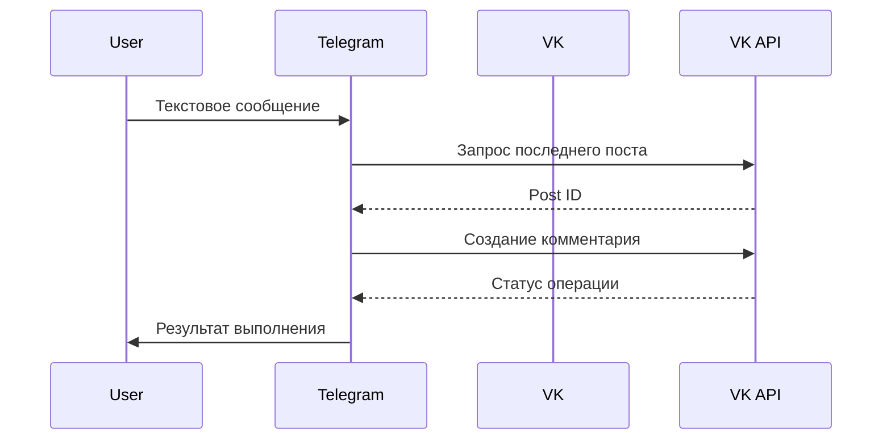

# Лабораторная работа 10: Трансляция сообщений Telegram → VK

<div align="center">
  
  
</div>

## 🎯 Выполненные требования
### Реализованный функционал
```python
# Основной обработчик сообщений
@bot.message_handler(content_types=['text'])
def handle_message(message):
    send_to_vk_comment(message.text)
```
- Вариант 3: Комментирование последнего поста на стене
- Автоматическое определение ID последней публикации
- Уведомление пользователя об успехе/ошибке

### Архитектура решения



## 🛠️ Технические детали
### Ключевые функции
```python
def get_last_post_id():
    """Получает ID последнего поста через VK API"""
    response = requests.get(url, params=params).json()
    return response['response']['items'][0]['id']

def send_to_vk_comment(message_text):
    """Отправка комментария с обработкой исключений"""
    resp = requests.post(url, params=params)
    print(resp.status_code, resp.text)
```

### Зависимости
```bash
pip install pyTelegramBotAPI requests python-dotenv
```

## 🔧 Настройка окружения
1. Создайте приложение VK:  
   [https://vk.com/apps?act=manage](https://vk.com/apps?act=manage)
2. Получите access_token с правами:
   - wall
   - offline
3. Заполните конфиг:
```python
TELEGRAM_TOKEN = 'ваш_токен_бота'
VK_ACCESS_TOKEN = 'vk5.131...'
VK_USER_ID = '123456789'  # Числовой ID профиля
```

## 🚀 Пример использования
```bash
# Отправка сообщения в Telegram-бота
Пользователь: Привет, это тестовое сообщение!

# Результат в VK
[Пост #228] → Комментарий: "Привет, это тестовое сообщение!"
```

