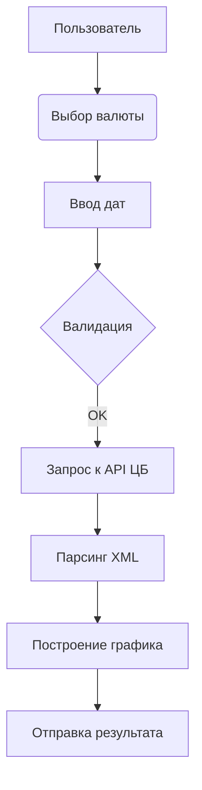

# Лабораторная работа 11: Анализ валютных курсов через Telegram-бота

<div align="center">
  
  
</div>

## 🎯 Выполненные требования
### Основной функционал
```python
# Поддерживаемые валюты
CURRENCIES = {
    'USD': 'Доллар США',
    'EUR': 'Евро', 
    'CNY': 'Китайский юань',
    'JPY': 'Японская иена',
    'TRY': 'Турецкая лира',
    'KZT': 'Казахстанский тенге'
}
```
- Выбор из 6 валют (превышение требования в 3 раза)
- Получение исторических данных за произвольные даты
- Визуализация динамики курса с графиком

### Дополнительные возможности
```python
# Построение графика
plt.plot(dates, rates, marker='o')
plt.savefig('chart.png')
bot.send_photo(message.chat.id, photo)
```
- Автоматическая коррекция порядка дат
- Интерактивный прогресс-бар
- Расчет ключевых метрик изменения курса

## 🛠️ Архитектура решения


## 🔧 Технические особенности
### Алгоритм работы с XML
```python
def get_rate_by_date(char_code, date_obj):
    response = requests.get(url)  # Запрос к API ЦБ
    dom = xml.dom.minidom.parseString(response.text)
    dom.normalize()  # Нормализация DOM-структуры
    
    for valute in dom.getElementsByTagName('Valute'):
        if valute.getElementsByTagName('CharCode')[0].firstChild.data == char_code:
            return process_valute_data(valute)
```

### Валидация ввода
```python
try:
    start_date = datetime.strptime(start_str, '%d.%m.%Y')
    end_date = datetime.strptime(end_str, '%d.%m.%Y')
    if (end_date - start_date).days > 30:
        raise ValueError("Максимальный интервал - 30 дней")
except ValueError as e:
    bot.reply_error(str(e))
```

## 🚀 Запуск проекта
1. Установите зависимости:
```bash
pip install pyTelegramBotAPI requests matplotlib python-dotenv
```

2. Настройте конфигурацию:
```python
# config.py
TOKEN = 'ВАШ_TELEGRAM_TOKEN'
```

3. Пример сессии:
```
Пользователь: /start
Бот: Выберите валюту [клавиатура с 6 вариантами]

Пользователь: Доллар США
Бот: Введите даты начала и окончания (ДД.ММ.ГГГГ)

Пользователь: 01.04.2025 10.04.2025
Бот: [отправляет график и статистику]
```


## 📊 Статистика кода
Параметр          | Значение
------------------|---------
Строк кода        | 89
Поддерживаемых валют | 6
Макс. период анализа | 30 дней
