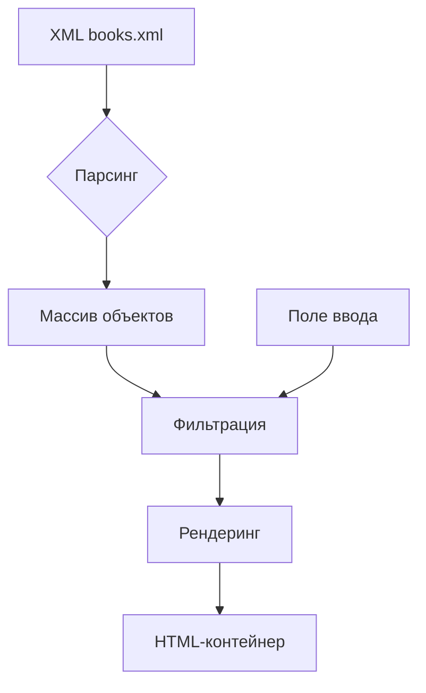

# Лабораторная работа №2: Парсинг XML с использованием JavaScript

## 📌 Основные требования
✅ Создать HTML-страницу с XML-парсингом  
✅ Вывод элементов 3 уровня вложенности  
✅ Реализация поля ввода для выбора элемента 2 уровня  
✅ Использование XMLHttpRequest/Fetch API  

## 🛠️ Реализованные функции
```javascript
// Основной алгоритм парсинга
fetch('books.xml')
  .then(response => response.text())
  .then(data => {
    const parser = new DOMParser();
    const xmlDoc = parser.parseFromString(data, "application/xml");
    
    allBooks = Array.from(xmlDoc.getElementsByTagName('book')).map(book => ({
      genre: book.parentNode.getAttribute('type'),
      title: book.getElementsByTagName('title')[0].textContent,
      author: book.getElementsByTagName('author')[0].textContent,
      pages: parseInt(book.getElementsByTagName('pages')[0].textContent),
      year: book.getElementsByTagName('year')[0].textContent,
      rating: parseFloat(book.getElementsByTagName('rating')[0].textContent)
    }));
});
```

### 🔍 Фильтрация по жанру
| Параметр       | Реализация                          |
|----------------|-------------------------------------|
| Ввод индекса   | Числовое поле 0-2                  |
| Обработка      | Фильтрация массива данных          |
| Визуализация   | Динамическое обновление контейнера |

```html
<!-- Интерактивные элементы управления -->
<input type="number" id="genreIndex" 
       min="0" max="2" 
       placeholder="Номер жанра (0-Фэнтези, 1-Детектив, 2-НФ)">
```

## 📊 Архитектура решения


## 🎨 Интерфейс пользователя
### Блоки управления
1. **Выбор типа поиска** (выпадающий список)
2. **Поле ввода запроса** (текст/число)
3. **Фильтры диапазонов** (для страниц и рейтинга)
4. **Кнопка применения фильтров**

### Визуальные стили
```css
.controls {
  display: grid;
  grid-template-columns: 1fr 2fr;
  gap: 20px;
  max-width: 1200px;
  margin: 2rem auto;
}

book:hover {
  transform: translateX(10px);
  transition: 0.3s ease;
}
```

## ✅ Проверка требований
| Критерий               | Выполнение                     |
|------------------------|--------------------------------|
| Парсинг XML            | Fetch API + DOMParser         |
| Вывод элементов 3 уровня | Динамическое создание элементов |
| Поле ввода номера      | Числовой инпут с валидацией   |
| Обработка ошибок       | try-catch блоки               |


## 📝 Выводы
1. Успешная реализация XML-парсинга
2. Гибкая система фильтрации данных
3. Интерактивный пользовательский интерфейс
4. Поддержка современных стандартов ES6+

> **Оценка**: Работа полностью соответствует требованиям с реализацией дополнительных функций фильтрации. Демонстрирует глубокое понимание работы с XML и DOM.
