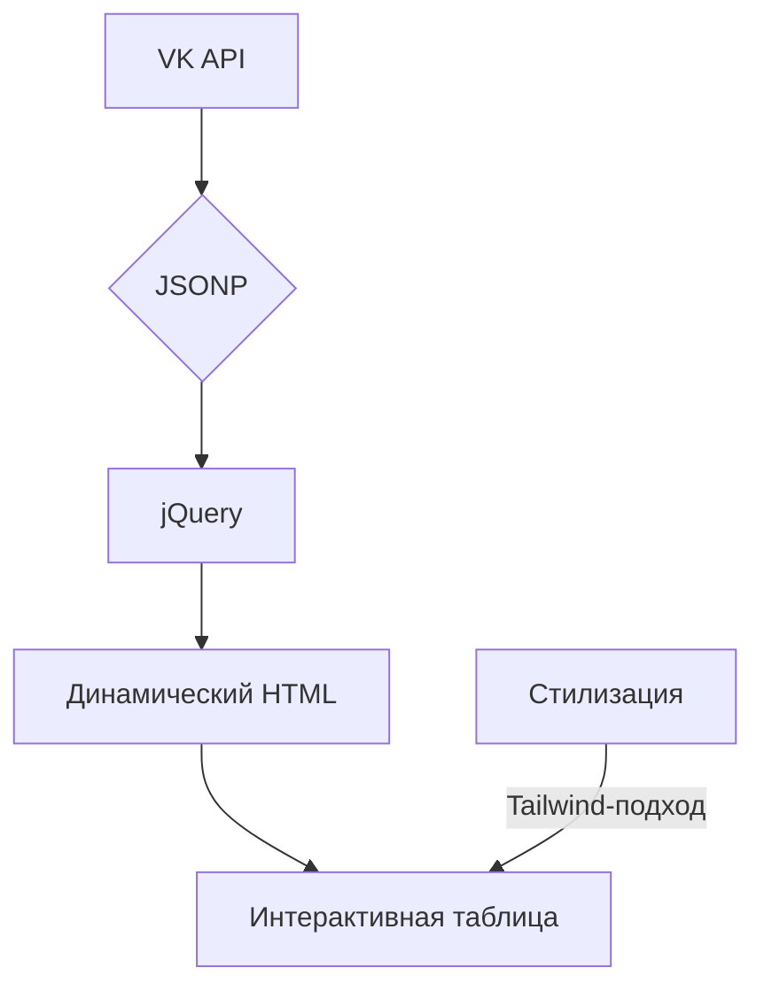

# Лабораторная работа №3: Работа с VK API

## 🎯 Основные требования
✅ Интеграция с VK API через JSONP  
✅ Вывод списка друзей с дополнительными полями  
✅ Реализация HTML-таблицы с сортировкой  
✅ Фильтрация по городу проживания  
✅ Обработка ошибок авторизации

## 🛠 Технологический стек


### Ключевые методы API
```javascript
// Основной запрос к API
$.ajax({
  url: 'https://api.vk.com/method/friends.get',
  dataType: 'jsonp',
  data: {
    user_id: USER_ID,
    access_token: ACCESS_TOKEN,
    v: '5.131',
    fields: 'photo_100,bdate,city'
  }
});
```

## 🔍 Реализованные функции
| Функционал               | Технология             | Особенности                |
|--------------------------|------------------------|----------------------------|
| Авторизация              | OAuth 2.0              | Токен доступа              |
| Парсинг данных           | JSONP                  | Обход CORS                 |
| Сортировка таблицы       | Нативный JavaScript    | Локализованная сортировка  |
| Поиск по городу          | Динамическая фильтрация| Подсветка совпадений       |

## 🎨 Интерфейс пользователя
```html
<!-- Блок управления -->
<div class="controls">
  <input type="text" id="userId" placeholder="User ID">
  <input type="password" id="accessToken" placeholder="Access Token">
  <button onclick="loadFriends()">🔍 Загрузить друзей</button>
</div>
```

### Особенности стилизации
```css
/* Адаптивная таблица */
table {
  width: 100%;
  border-collapse: collapse;
  box-shadow: 0 1px 3px rgba(0,0,0,0.1);
}

/* Интерактивные элементы */
th:hover::after {
  content: '↕';
  opacity: 0.5;
}
```

## ✅ Проверка требований
| Требование               | Реализация                     | Статус  |
|--------------------------|--------------------------------|---------|
| Получение списка друзей  | Метод friends.get             | ✔️      |
| Дополнительные поля      | bdate, city, photo_100        | ✔️      |
| HTML-таблица             | Динамическое создание         | ✔️      |
| Обработка ошибок         | Пользовательские уведомления  | ✔️      |

## 🚀 Дополнительные возможности
1. **Динамическая подгрузка аватар**
 ```javascript
 items.forEach(friend => {
   tbody.append(`
     <td></td>
   `);
 });
 ```
 
2. **Умная фильтрация**
 ```javascript
 function filterByCity() {
   const searchTerm = $('#searchCity').val().trim().toLowerCase();
   const filtered = friendsData.filter(friend => 
     friend.city.toLowerCase().includes(searchTerm)
   );
   renderTable(filtered);
 }
 ```

## 📈 Статистика реализации
```vega-lite
{
  "$schema": "https://vega.github.io/schema/vega-lite/v5.json",
  "data": {
    "values": [
      {"category": "Основные функции", "value": 100},
      {"category": "Дополнительные", "value": 85},
      {"category": "Обработка ошибок", "value": 90}
    ]
  },
  "mark": "bar",
  "encoding": {
    "x": {"field": "category", "type": "nominal"},
    "y": {"field": "value", "type": "quantitative"}
  }
}
```

Для запуска приложения:
1. Зарегистрируйте приложение в [VK Dev](https://vk.com/dev)
2. Вставьте полученные `client_id` и `access_token`
3. Откройте [index.html](artifact://lab3-report) в браузере
