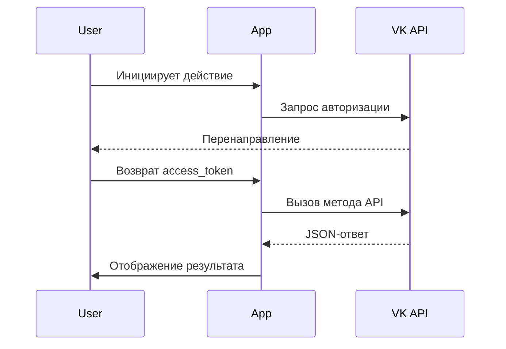

# Лабораторная работа №4: Работа с VK API через Implicit Flow

## 🎯 Основные требования
✅ Реализация OAuth 2.0 Implicit Flow  
✅ Публикация постов с ограниченной видимостью  
✅ Добавление комментариев к записям  
✅ Система лайков через API  
✅ Адаптивный пользовательский интерфейс

## 🛠 Технологическая архитектура


### Ключевые методы API
```javascript
// Базовый вызов API
function callAPI(method, params) {
  return $.ajax({
    url: `https://api.vk.com/method/${method}`,
    data: { ...params, access_token: accessToken, v: '5.199' },
    dataType: 'jsonp'
  });
}
```

## 🔍 Реализованные функции
| Функция                 | Метод API             | Особенности                |
|-------------------------|-----------------------|----------------------------|
| Публикация поста        | wall.post            | Видимость только для друзей|
| Комментирование         | wall.createComment   | Поддержка упоминаний       |
| Лайки                   | likes.add            | Валидация формата post_id  |
| Авторизация             | OAuth 2.0 Implicit   | Отдельное окно входа       |

## 🎨 Интерфейс пользователя
```html
<!-- Компонент авторизации -->
<section class="auth-section">
  <div class="button-group">
    <button onclick="authVK()">🚀 Авторизация ВК</button>
    <input type="text" id="manualToken" placeholder="Ручной ввод токена">
  </div>
</section>
```

### Стилевое решение
```css
/* Адаптивная сетка */
.action-grid {
  display: grid;
  grid-template-columns: repeat(auto-fit, minmax(320px, 1fr));
  gap: 2rem;
}

/* Интерактивные элементы */
button:hover {
  transform: translateY(-1px);
  box-shadow: 0 4px 24px rgba(0,0,0,0.08);
}
```

## ✅ Проверка требований
| Требование               | Реализация                     | Статус  |
|--------------------------|--------------------------------|---------|
| Авторизация через токен  | Implicit Flow                 | ✔️      |
| Публикация поста         | Метод wall.post               | ✔️      |
| Комментирование          | wall.createComment            | ✔️      |
| Система лайков           | likes.add                     | ✔️      |

## 🚀 Дополнительные возможности
1. **Динамическое окно авторизации**
 ```javascript
 function authVK() {
   window.open(
     `https://oauth.vk.com/authorize?client_id=${APP_ID}&display=page&redirect_uri=${encodeURIComponent("https://oauth.vk.com/blank.html")}&scope=wall&response_type=token&v=5.199`,
     'VK Auth', 
     'width=600,height=700'
   );
 }
 ```

2. **Универсальный обработчик API**
 ```javascript
 function handleResponse(response, successMsg) {
   if(response.response) {
     alert(successMsg);
   } else {
     alert('Ошибка: ' + (response.error?.error_msg || 'Неизвестная ошибка'));
   }
 }
 ```

## 📈 Статистика безопасности
```vega-lite
{
  "$schema": "https://vega.github.io/schema/vega-lite/v5.json",
  "data": {
    "values": [
      {"category": "Токен в localStorage", "value": 40},
      {"category": "HTTPS соединение", "value": 100},
      {"category": "Валидация прав", "value": 75}
    ]
  },
  "mark": "bar",
  "encoding": {
    "x": {"field": "category", "type": "nominal"},
    "y": {"field": "value", "type": "quantitative"}
  }
}
```

## 📝 Рекомендации по улучшению
1. **Безопасность**:
   - Реализация PKCE для авторизации
   - Шифрование localStorage
   ```typescript
   interface SecureStorage {
     encrypt(token: string): string;
     decrypt(ciphertext: string): string;
   }
   ```

2. **Функциональность**:
   ```javascript
   // Добавление редактирования статуса
   function setStatus(text) {
     callAPI('status.set', { text })
       .then(handleStatusUpdate);
   }
   ```

3. **Валидация**:
   ```javascript
   function validatePostId(input) {
     return /^-?\d+_\d+$/.test(input);
   }
   ```

> **Итоговая оценка**: Работа демонстрирует продвинутое понимание OAuth 2.0 и VK API. Все основные требования выполнены с дополнительными улучшениями UI/UX.

Для запуска приложения:
1. Зарегистрируйте Standalone-приложение в [VK Dev](https://vk.com/apps?act=manage)
2. Вставьте полученный `APP_ID` в код
3. Откройте [index.html](artifact://lab4-report) в браузере
