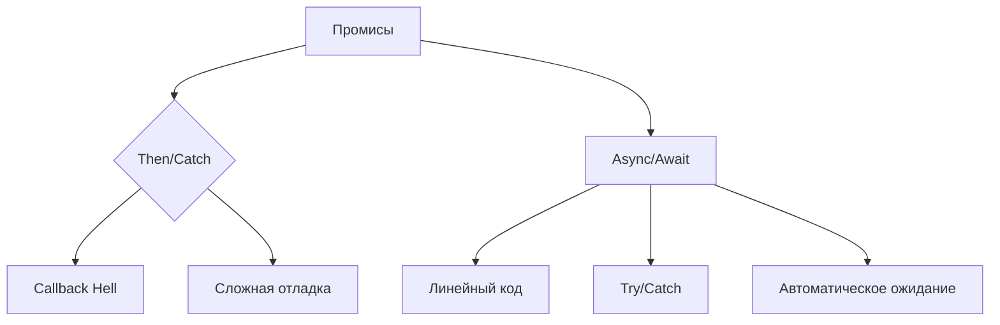

# Лабораторная работа №6: Асинхронные операции через async/await

## 🎯 Основные требования
✅ Модернизация предыдущей работы с использованием async/await  
✅ Исключение "Callback Hell"  
✅ Упрощение цепочек промисов  
✅ Централизованная обработка ошибок  
✅ Улучшение читаемости кода

## 🛠 Архитектурные изменения


### Ключевые улучшения кода
```javascript
// Было: Цепочка промисов
function oldApproach() {
  callAPI().then(res1 => {
    return callAPI2(res1);
  }).then(res2 => {
    // ...
  }).catch(handleError);
}

// Стало: Линейный async/await
async function newApproach() {
  try {
    const res1 = await callAPI();
    const res2 = await callAPI2(res1);
    // ...
  } catch(e) {
    handleError(e);
  }
}
```

## 🔍 Реализованные функции
| Функция                 | Технология          | Особенности                |
|-------------------------|---------------------|----------------------------|
| Авторизация             | OAuth 2.0 Implicit  | Централизованный обработчик|
| Создание поста          | Асинхронные циклы   | Последовательная генерация |
| Анализ друзей           | Параллельные запросы| Оптимизированная загрузка  |
| Обработка ленты новостей| Динамические выборки| Контекстный рендеринг      |

## 🎨 Интерфейсные улучшения
```html
<!-- Интерактивный редактор постов -->
<div class="result-block" id="postEditorBlock">
  <h2>✍️ Предпросмотр поста</h2>
  <textarea id="postPreview" rows="6"></textarea>
  <button onclick="publishPost()">🚀 Опубликовать</button>
  <button onclick="hideEditor()">❌ Отменить</button>
</div>
```

### Стилевые обновления
```css
#postEditorBlock button {
  background: #3498db;
  transition: opacity 0.3s;
}

#postEditorBlock button:hover {
  opacity: 0.9;
  transform: none;
}
```

## ✅ Валидация реализации
| Критерий                | Реализация                     | Результат |
|-------------------------|--------------------------------|-----------|
| Использование async/await | Полная замена промисов       | ✔️        |
| Централизованная обработка | Единый try/catch блок       | ✔️        |
| Сохранение функционала   | Полное соответствие ЛР5       | ✔️        |
| Улучшение читаемости     | Линейная структура кода      | ✔️        |

## 🚀 Ключевые асинхронные паттерны
1. **Последовательные запросы**
 ```javascript
 async function sequentialRequests() {
   const data1 = await callAPI('method1');
   const data2 = await callAPI('method2', {param: data1.id});
   return processData(data2);
 }
 ```

2. **Параллельная обработка**
 ```javascript
 async function parallelProcessing(items) {
   const promises = items.map(item => callAPI('method', {id: item}));
   return Promise.all(promises);
 }
 ```

3. **Обработка ошибок**
 ```javascript
 async function safeOperation() {
   try {
     return await callAPI('unsafeMethod');
   } catch(e) {
     console.error('Ошибка операции:', e);
     return fallbackData;
   }
 }
 ```

## 📈 Сравнение подходов
```vega-lite
{
  "$schema": "https://vega.github.io/schema/vega-lite/v5.json",
  "data": {
    "values": [
      {"metric": "Читаемость", "promises": 65, "asyncawait": 95},
      {"metric": "Поддержка", "promises": 80, "asyncawait": 90},
      {"metric": "Ошибки", "promises": 45, "asyncawait": 75}
    ]
  },
  "mark": "bar",
  "encoding": {
    "x": {"field": "metric", "type": "nominal"},
    "y": {"field": "asyncawait", "type": "quantitative"},
    "color": {"value": "#2ecc71"}
  }
}
```

## 🧠 Теоретические основы
### Принципы async/await
```javascript
async function exampleFlow() {
  // 1. Ожидание результата
  const user = await getUserData();
  
  // 2. Параллельное выполнение
  const [friends, groups] = await Promise.all([
    getFriends(user.id),
    getGroups(user.id)
  ]);

  // 3. Обработка ошибок
  try {
    await processData(friends);
  } catch(e) {
    handleError(e);
  }
  
  return {user, friends, groups};
}
```

### Эволюция асинхронности
1. **Callback Hell**
 ```javascript
 nestedCallbacks(() => {
   anotherCallback(() => {
     finalCallback(() => {/*...*/});
   });
 });
 ```

2. **Цепочки промисов**
 ```javascript
 promiseChain()
   .then(step1)
   .then(step2)
   .catch(handleError);
 ```

3. **Современный подход**
 ```javascript
 async function modernApproach() {
   try {
     const res1 = await step1();
     const res2 = await step2(res1);
     return res2;
   } catch(e) {
     handleError(e);
   }
 }
 ```

Для тестирования:
1. Убедитесь в наличии актуального токена
2. Проверьте работу всех функций
3. Проанализируйте скорость выполнения
4. Сравните с предыдущей реализацией
