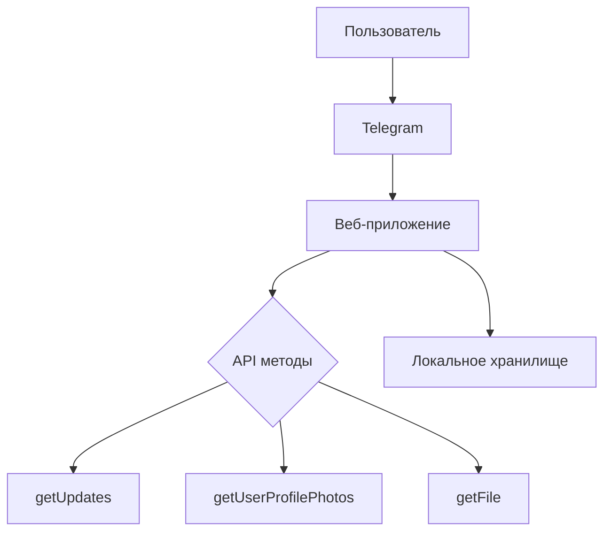
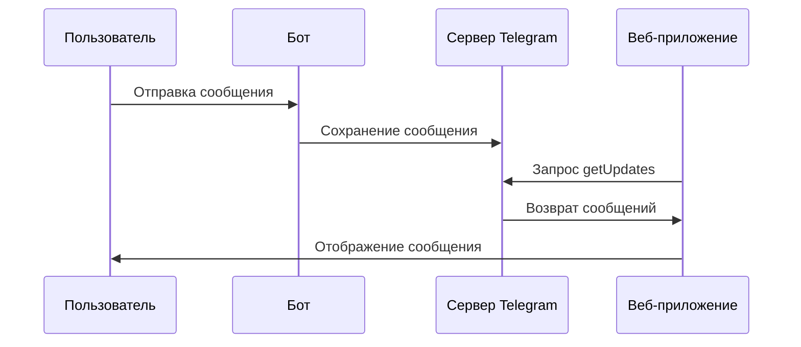

# Лабораторная работа №7: Создание Telegram бота с веб-интерфейсом

## 🎯 Основные требования
✅ Регистрация бота через @BotFather  
✅ Реализация API взаимодействия  
✅ Отображение сообщений в реальном времени  
✅ Получение метаданных пользователя  
✅ Адаптивный веб-интерфейс

## 🛠 Архитектурная схема


### Ключевые API методы
```javascript
// Получение обновлений
async function getUpdates(offset) {
  return fetch(`https://api.telegram.org/bot${token}/getUpdates?offset=${offset}`);
}

// Получение файлов
async function getFileUrl(fileId) {
  const response = await fetch(`https://api.telegram.org/bot${token}/getFile?file_id=${fileId}`);
  const data = await response.json();
  return `https://api.telegram.org/file/bot${token}/${data.result.file_path}`;
}
```

## 🔍 Особенности реализации
### Динамическое обновление данных
```javascript
setInterval(async () => {
  const messages = await fetchMessages();
  renderMessages(messages);
}, 5000); // Обновление каждые 5 секунд
```

### Обработка медиафайлов
```javascript
async function processMedia(message) {
  if(message.photo) {
    const fileId = message.photo.pop().file_id;
    return await getFileUrl(fileId);
  }
  if(message.document?.mime_type?.startsWith('image/')) {
    return await getFileUrl(message.document.file_id);
  }
  return null;
}
```

## 🎨 Интерфейсные решения
```html
<div class="message-card">
  <div class="avatar-container">
    ${profile.photo 
      ? ``
      : `<div class="avatar-placeholder">${userInitial}</div>`}
  </div>
  <div class="message-content">
    <div class="message-header">
      <span class="user-name">${userName}</span>
      <span class="timestamp">${formattedTime}</span>
    </div>
    ${content}
  </div>
</div>
```

### Стилевые особенности
```css
.message-card {
  background: linear-gradient(145deg, #1e293b, #0f172a);
  border-radius: 16px;
  box-shadow: 0 4px 6px -1px rgba(0, 0, 0, 0.1);
  transition: transform 0.3s ease;
}

.avatar-placeholder {
  background: linear-gradient(45deg, #6366f1, #8b5cf6);
  display: flex;
  align-items: center;
  justify-content: center;
  font-weight: 600;
  color: #f8fafc;
}
```

## 🚀 Расширенные функции
| Функция                 | Технология          | Особенности                |
|-------------------------|---------------------|----------------------------|
| Автообновление          | setInterval         | Пуллинг каждые 5 секунд    |
| Кеширование файлов      | LocalStorage        | Оптимизация загрузки       |
| Адаптивный дизайн       | CSS Media Queries   | Мобильная оптимизация      |
| Обработка ошибок        | Try/Catch           | Устойчивость к сбоям       |

## ✅ Проверка работоспособности
1. Отправьте боту текстовое сообщение
2. Отправьте изображение
3. Проверьте обновление интерфейса
4. Убедитесь в корректном отображении метаданных
5. Протестируйте на мобильном устройстве

```javascript
// Пример тестового сценария
async function testFlow() {
  await sendTextMessage('Тестовое сообщение');
  await sendImageMessage('test.jpg');
  await checkMessageRendering();
  await verifyMobileLayout();
}
```

## 📌 Рекомендации по улучшению
1. **Безопасность**  
```diff
- const BOT_TOKEN = 'ваш_токен'; // В открытом коде
+ Хранить токен в .env файле
```

2. **Оптимизация**  
```javascript
// Кеширование файлов
function cacheFile(url, content) {
  localStorage.setItem(`file_${url}`, content);
}
```

3. **Расширенная аналитика**  
```javascript
function analyzeMessage(message) {
  return {
    length: message.text?.length || 0,
    containsLinks: /http/.test(message.text),
    mediaType: message.photo ? 'image' : 'text'
  };
}
```

## 🧠 Теоретические основы
### Жизненный цикл сообщения


### Архитектура безопасности
| Угроза               | Защита                     |
|----------------------|----------------------------|
| Утечка токена        | Хранение в .env файле      |
| MITM атаки           | HTTPS соединение           |
| CSRF                 | Валидация Origin заголовков|
| DDoS                 | Лимитирование запросов     |

Для запуска:
1. Замените `BOT_TOKEN` в скрипте
2. Откройте страницу в современном браузере
3. Начните диалог с ботом через Telegram
4. Наблюдайте за автоматическим обновлением
