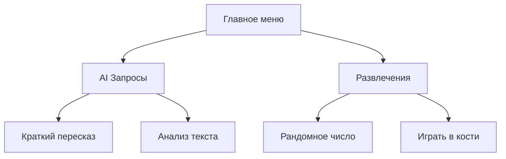

# Лабораторная работа 8: Telegram-бот с иерархическим меню


## 📝 Описание
Telegram-бот с многоуровневым меню для взаимодействия с сервисами:
- Парсинг веб-страниц через Яндекс.API
- Генерация краткого контента
- Игровые функции

## 🛠️ Установка
```bash
git clone https://github.com/yourusername/telegram-menu-bot.git
cd telegram-menu-bot
pip install -r requirements.txt

# Создайте .env файл
echo "TOKEN_TELE=your_telegram_token" >> .env
echo "TOKEN_YA=your_yandex_token" >> .env
```

## 🌐 Архитектура меню


## 🎮 Использование
```python
# Пример обработки команд
@bot.message_handler(commands=['start'])
def start(message):
    keyboard = types.ReplyKeyboardMarkup(resize_keyboard=True)
    keyboard.add('AI Запросы', 'Развлечения')
    bot.send_message(message.chat.id, 'Выберите раздел:', reply_markup=keyboard)
```

## 📊 Статистика
Реализация счётчика нажатий:
```python
from collections import defaultdict
button_stats = defaultdict(int)

@bot.message_handler(content_types=["text"])
def handle_click(message):
    button_stats[message.text] += 1
    # Для просмотра: /stats
```

## 🔄 Запуск
```bash
python main.py
# Для разработки с hot-reload:
watchmedo auto-restart --pattern="*.py" --recursive -- python main.py
```
