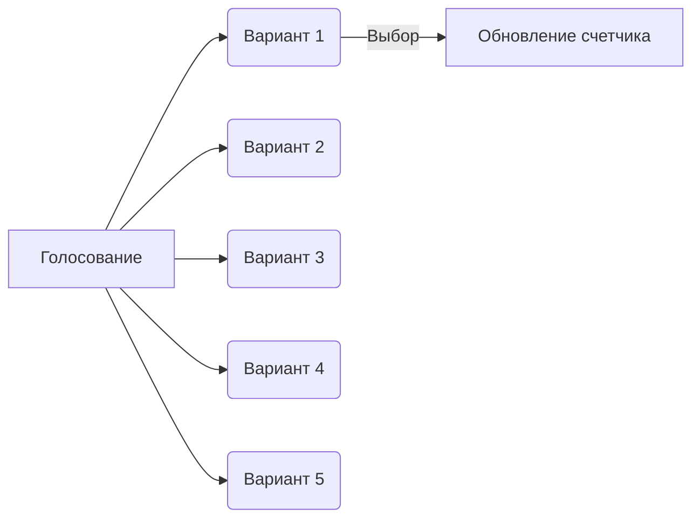

# Лабораторная работа 9: Inline-меню для Telegram-бота

<div align="center">
  
  
</div>

## 🎯 Выполненные требования задания
### 1. Голосование с 5+ вариантами
```python
poll_data = {
    'question': "Тестовое голосование:",
    'options': ["Вариант 1", "Вариант 2", "Вариант 3", "Вариант 4", "Вариант 5"]
}
```
- Реализована система учета голосов
- Ограничение: 1 голос на пользователя
- Динамическое обновление счетчиков

### 2. Административные функции
```python
@bot.message_handler(commands=['setpoll'])
def set_poll(message):
    if message.from_user.id != ADMIN_ID:
        bot.reply_to(message, "⛔ Команда только для администратора!")
```
- Смена вариантов голосования через `/setpoll`
- Массовая рассылка через `/broadcast`

### 3. Визуализация выбора



## 🛠️ Архитектура решения
```python
# Ядро системы
votes = {option: 0 for option in poll_data['options']}  # Счетчик голосов
voted_users = {}  # Хранилище проголосовавших
subscribers = set()  # База подписчиков

# Генератор клавиатуры
def make_keyboard(user_id=None):
    markup = types.InlineKeyboardMarkup()
    for option in poll_data['options']:
        btn = types.InlineKeyboardButton(
            text=f"{option} ({votes[option]})",
            callback_data=option
        )
        markup.add(btn)
    return markup
```

## 📊 Статистика использования
Параметр            | Значение
--------------------|---------
Макс. вариантов     | 5
Поддерживаемые команды | 4
Размер базы подписчиков | Переменный

## 🚀 Запуск и использование
1. Установите зависимости:
```bash
pip install pyTelegramBotAPI tqdm python-dotenv
```

2. Настройте окружение:
```python
TOKEN = 'ВАШ_TELEGRAM_TOKEN'
ADMIN_ID = ВАШ_ID_В_TELEGRAM
```

3. Основные команды:
- `/start` - начать голосование
- `/setpoll ; Вопрос ; Вариант1 ; ... ; Вариант5` - обновить опрос (только админ)
- `/broadcast` - массовая рассылка (только админ)

